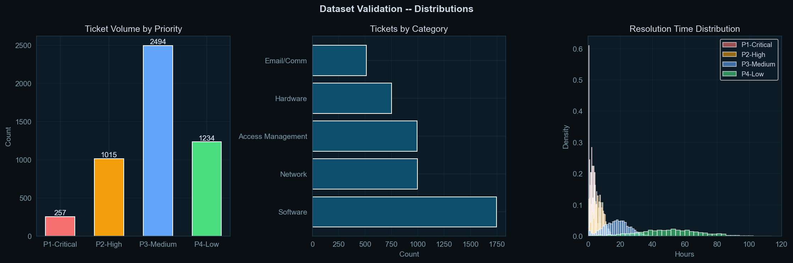

# IT Service Desk Operations Analytics
### Diagnosing SLA Failures, Agent Bottlenecks, and Resolution Delays Across 5,000 Tickets — Jan to Jun 2025


---

## Table of Contents
1. [Project Background](#project-background)
2. [North-Star Metrics](#north-star-metrics)
3. [Executive Summary](#executive-summary)
4. [Insight Deep Dive](#insight-deep-dive)
   - [SLA Compliance by Priority](#1-sla-compliance-by-priority)
   - [Breach Patterns by Day of Week](#2-breach-patterns-by-day-of-week)
   - [Agent Workload and Performance](#3-agent-workload-and-performance)
   - [MTTR Trends Over 6 Months](#4-mttr-trends-over-6-months)
   - [Category-Level Failure Analysis](#5-category-level-failure-analysis)
5. [Recommendations](#recommendations)
6. [Tech Stack](#tech-stack)

---

## Project Background

### Context

Every mid-to-large company runs an internal IT support function — a team of agents who resolve employee-reported problems ranging from network outages to password resets. These are logged as **support tickets** in systems like ServiceNow or JIRA and tracked against a **Service Level Agreement (SLA)**: a contractual promise that defines the maximum time allowed to resolve each ticket depending on its urgency.

For IT services companies like TCS, Genpact, or Accenture — who operate service desks on behalf of clients — SLA compliance is not a performance metric, it is a contractual obligation. Missing SLA targets triggers financial penalties and damages client relationships. The IT Operations Director needs to know not just *whether* SLAs are being missed, but *where*, *when*, and *why* — so the right fix goes to the right place.

### Dataset

This project uses a synthetic dataset of **5,000 IT helpdesk tickets** generated to mirror the schema and behavioral patterns of real ServiceNow data, including realistic priority distributions, agent workload imbalance, and time-of-day ticket patterns. The dataset spans January to June 2025 across 15 agents and 5 ticket categories.

| Field | Description |
|---|---|
| `ticket_id` | Unique identifier — INC-XXXXX format |
| `created_at` / `resolved_at` | Open and close timestamps |
| `priority` | P1-Critical / P2-High / P3-Medium / P4-Low |
| `category` | Network / Hardware / Software / Access Management / Email |
| `agent_id` | Assigned agent (15 agents total) |
| `resolution_hours` | Actual hours taken to resolve |
| `sla_limit_hours` | Contracted maximum resolution time |
| `sla_breach` | True if resolution exceeded the SLA limit |
| `csat_score` | Customer satisfaction rating (1–5) |

**SLA contract thresholds:**

| Priority | SLA Limit | Typical Scenario |
|---|---|---|
| P1-Critical | 4 hours | Server down, network outage affecting multiple users |
| P2-High | 8 hours | Application crash, security incident |
| P3-Medium | 24 hours | Slow performance, software bug |
| P4-Low | 72 hours | Password reset, access request |

### Goal

> *"SLA compliance has fallen below the 90% contract target. Identify where failures are concentrated, which agents are under pressure, and what operational changes will move the needle fastest."*

---

## North-Star Metrics

Four metrics drive every decision in IT operations analytics. Everything in this project connects back to at least one of them.

| Metric | Definition | Contract Target | Actual Result | Status |
|---|---|---|---|---|
| **SLA Compliance Rate** | % of tickets resolved within the SLA time limit | 90.0% | **76.8%** | BELOW TARGET |
| **Overall MTTR** | Mean Time To Resolve across all ticket types | < 12h | **22.97h** | ABOVE TARGET |
| **P1-Critical Breach Rate** | % of critical tickets that exceed the 4-hour SLA | < 10% | **30.4%** | CRITICAL |
| **Agent Workload Ratio** | Ticket load of most-loaded vs least-loaded agent | < 2.0x | **3.4x** | UNEVEN |

### Why these four matter

**SLA Compliance Rate** is the headline contractual number — it is what the client reads first in a monthly review and what determines whether penalties apply.

**MTTR** is the operational efficiency signal — it tells you whether the system is speeding up, slowing down, or stagnating regardless of whether individual tickets breach.

**P1 Breach Rate** is tracked separately because a P1 breach is categorically different from a P3 breach. When a P1 ticket breaches, a business-critical system has been down longer than promised. The cost is exponentially higher — in user productivity, client trust, and potential penalty exposure.

**Agent Workload Ratio** is tracked because SLA failures are often a capacity distribution problem rather than a skills problem. An imbalanced team produces worse outcomes even when total team capacity is theoretically sufficient.

---

## Executive Summary

The IT service desk processed **5,000 tickets between January and June 2025**, averaging 833 tickets per month across 15 agents and 5 ticket categories. Overall SLA compliance stands at **76.8%** — 13.2 percentage points below the contracted 90% target, with **1,160 tickets (23.2%) breaching their SLA**.

The most urgent finding is that **P2-High tickets have the highest breach rate in the dataset at 34.2%** — worse than P1-Critical at 30.4%. P2 tickets represent serious incidents (application crashes, security issues) with an 8-hour SLA window, yet they fail more often than the most critical tier. This points to a structural triage gap: P1 tickets trigger immediate escalation and visibility, but P2 tickets compete with high-volume P3 work in standard queues and are systematically de-prioritised.

Agent workload is significantly uneven. AGT-00001 handles 609 tickets, AGT-00002 handles 599, and AGT-00003 handles 560 — against a team average of 333. These three agents collectively handle 35.4% of all volume. Despite this, the highest breach rate in the team (29.3%) belongs to AGT-00007, who handles only 382 tickets — 14% above average but well within normal range. This rules out a simple overload narrative and points to a secondary process or category-routing issue specific to that agent.

MTTR across the 6-month period averages **22.97 hours overall**, with P1-Critical averaging 3.05 hours and P4-Low averaging 50.53 hours. The weekly MTTR trend is entirely flat across 26 weeks — oscillating between 15.54h and 25.41h with no sustained improvement — indicating no process changes during this period had a measurable effect on resolution speed.

The breach heatmap surfaces the most operationally actionable finding: **P1-Critical breach rates peak at 39.4% on Fridays** and P2-High peaks at 37.5% on Sundays. These are predictable, schedule-driven failure windows that can be addressed with targeted coverage changes rather than headcount increases.

---

## Insight Deep Dive

### 1. SLA Compliance by Priority


**What the data shows**

Every priority tier is below the 90% SLA target. The breakdown:

| Priority | Tickets | Breached | Compliance | Breach Rate |
|---|---|---|---|---|
| P1-Critical | 257 | 78 | 69.6% | 30.4% |
| P2-High | 1,015 | 347 | 65.8% | **34.2% — worst tier** |
| P3-Medium | 2,494 | 555 | 77.7% | 22.3% |
| P4-Low | 1,234 | 180 | 85.4% | 14.6% |

P2-High has the worst breach rate despite not being the highest-priority tier. P2 tickets are high-severity incidents with an 8-hour SLA, yet they fail more often than P1 tickets with a tighter 4-hour window. This inverted failure pattern is the central operational paradox of this dataset.

**Why P2 is the most structurally broken tier**

P1 tickets are impossible to ignore — they typically represent full outages and immediately attract senior engineer attention. P2 tickets, by contrast, are serious but not immediately visible. They enter standard agent queues and compete with the 2,494 P3-Medium tickets for attention. During busy periods, agents naturally triage toward volume, and P2 tickets get treated like escalated P3 work rather than as a tier deserving a dedicated response lane.

The category breach rates reinforce that no single category is driving the overall failure — all five categories sit above the 20% breach threshold (Access Management 24.8%, Software 23.9%, Hardware 23.6%, Email 21.9%, Network 20.7%). This is a system-wide compliance failure, not a category-specific outlier.

**What should change**

Separate P2 tickets from the general P3/P4 queue. Any P2 unacknowledged after 4 hours — half its SLA window — should auto-notify a supervisor. This creates a mid-SLA checkpoint that prevents silent breaches where a ticket simply never gets picked up until it is already late.

---

### 2. Breach Patterns by Day of Week


**What the data shows**

The heatmap crosses priority against day of week and surfaces patterns that a flat compliance percentage completely hides:

| Priority | Worst Day | Breach Rate | Best Day | Breach Rate | Swing |
|---|---|---|---|---|---|
| P1-Critical | Friday | **39.4%** | Wednesday | 25.6% | 13.8 pp |
| P2-High | Sunday | **37.5%** | Friday | 28.9% | 8.6 pp |
| P3-Medium | Monday | **24.4%** | Saturday | 20.3% | 4.1 pp |
| P4-Low | Tuesday | **18.2%** | Wednesday | 11.7% | 6.5 pp |

P1-Critical shows a 13.8 percentage point swing between its best and worst days — the largest day-of-week variance in the dataset. Wednesday is the safest day for critical tickets; Friday is significantly the most dangerous. This is not random noise: Friday represents the end of the structured work week, when senior engineers are context-switching to wrap up weekly work and handoffs to weekend staff are occurring. Critical tickets raised at 4PM Friday face a fundamentally different response environment than those raised at 10AM Wednesday.

P2-High peaks on Saturday and Sunday at 36.9% and 37.5%, compared to a weekday average closer to 33%. The weekend gap is modest in absolute terms — about 4 percentage points — but for tickets with an 8-hour SLA, a weekend arrival with reduced staffing is structurally disadvantaged.

**Why this reframes the problem**

A 30.4% P1 breach rate sounds like a capacity problem requiring more staff. A 39.4% P1 breach rate specifically on Fridays sounds like a scheduling problem requiring a triage protocol. The heatmap transforms an expensive, slow solution (hire more engineers) into a cheap, fast one (change how Friday afternoons are managed). This is exactly the kind of insight that gets a data analyst noticed in an operational review.

**What should change**

Implement a Friday 3PM P1/P2 sweep: a designated senior engineer reviews all open P1 and P2 tickets, ensures each has a clear owner and an estimated resolution time, and hands off appropriately before end of business. For weekend P2 coverage, establish a rotating on-call slot Friday 6PM through Monday 8AM specifically for P2 triage — not full resolution, just acknowledgement and assignment within the SLA window.

---

### 3. Agent Workload and Performance


**What the data shows**

The 15-agent team shows a 3.4x load ratio between the busiest and least busy agents:

| Agent | Tickets | Breach Rate | Avg CSAT | Flag |
|---|---|---|---|---|
| AGT-00001 | **609** | 21.8% | 3.49 | Overloaded |
| AGT-00002 | **599** | 21.0% | 3.44 | Overloaded |
| AGT-00003 | **560** | 25.9% | 3.46 | Overloaded |
| AGT-00007 | 382 | **29.3%** | 3.30 | Normal |
| AGT-00005 | 359 | 24.8% | 3.30 | Normal |
| AGT-00012 | 182 | **19.2%** | 3.51 | Underloaded |
| Team avg | **333** | **23.1%** | 3.40 | — |

The CSAT vs Breach Rate scatter plot reveals the most nuanced finding: AGT-00007 produces the highest breach rate (29.3%) in the entire team on a normal workload of 382 tickets. Meanwhile AGT-00001 handles 609 tickets — 83% above average — and maintains a 21.8% breach rate that is below team average.

**Two separate problems**

This data rules out a simple overload-causes-breaches story and separates the agent analysis into two distinct problems.

The first is structural volume imbalance: AGT-00001 through AGT-00003 are handling 560–609 tickets against a team average of 333. Even if their individual breach rates are currently at or below average, this concentration creates fragility — if any of these agents is absent, or if ticket volume increases, the concentrated load produces immediate system stress.

The second is an unresolved performance issue with AGT-00007. A 29.3% breach rate on 382 tickets cannot be explained by volume. Possible explanations include disproportionate assignment of complex Network or Hardware tickets (the categories with longer resolution tails in the box plot), a skills gap on specific ticket types, or inadequate tooling for the issues they are handling most often. This requires investigation rather than assumption.

**What should change**

For overloaded agents: implement volume-based queue balancing that caps individual loads at 1.2 times the team average for P3/P4 tickets, bringing AGT-00001 through AGT-00003 from 560–609 toward ~400. For AGT-00007: pull their ticket category distribution and compare it to AGT-00012 (lowest breach rate at 19.2%) to identify whether the gap is explained by ticket type before treating it as a performance conversation.

---

### 4. MTTR Trends Over 6 Months


**What the data shows**

Overall MTTR is 22.97 hours with a median of 17.50 hours — a mean-to-median gap of 5.47 hours that confirms a right-skewed distribution where a meaningful subset of tickets takes far longer than the typical case.

| Priority | Mean MTTR | Median MTTR | Std Dev | SLA Limit | Assessment |
|---|---|---|---|---|---|
| P1-Critical | 3.05h | 2.87h | **1.82h** | 4h | Mean within SLA, high variance breaches it |
| P2-High | 6.56h | 6.49h | **3.29h** | 8h | Mean within SLA, tail breaches it |
| P3-Medium | 18.07h | 18.11h | 7.86h | 24h | Consistent, within SLA on average |
| P4-Low | 50.53h | 50.72h | 19.99h | 72h | Consistent, within SLA on average |

Weekly MTTR ranges from a best of **15.54 hours (week 27)** to a worst of **25.41 hours (week 23)** across 26 weeks, with the 4-week rolling average remaining essentially flat throughout. No sustained improvement trend is visible in the data.

**The variance problem is more important than the mean**

The mean MTTR for P1 (3.05h) and P2 (6.56h) both sit comfortably within their SLA limits of 4h and 8h respectively — which initially makes the 30.4% and 34.2% breach rates confusing. The standard deviation resolves this: P1 has a std of 1.82h against a 4h SLA, meaning a substantial portion of P1 resolutions fall in the 4–6 hour range, past the threshold, even when the average looks acceptable.

This is a consistency problem, not an average performance problem. The team is capable of resolving P1 tickets well — the median is 2.87 hours. But the process has high variance, and the right tail of that variance is generating breach rates. Reducing std deviation from 1.82h to 1.0h would likely cut the P1 breach rate by more than improving the mean by 30 minutes would.

The flat 26-week trend is an equally important signal. No interventions during this period produced a measurable MTTR improvement. This means either no changes were attempted, or changes were attempted but did not affect resolution speed. Either conclusion points to the need for a structured improvement program with defined metrics and review cadence.

**What should change**

Set a MTTR early-warning threshold at 24 hours on the 4-week rolling average. If exceeded for two consecutive weeks, trigger a formal capacity and process review. Separately, investigate the source of P1 and P2 resolution variance — the goal is to compress the standard deviation, which means identifying what makes some P1 tickets take 5–6 hours when others take 1–2. The box plot shows Email and Access Management with the widest resolution spreads relative to their median, which is a good starting point for variance investigation.

---

### 5. Category-Level Failure Analysis



**What the data shows**

Software is the dominant ticket category at approximately 1,750 tickets (35%), followed by Access Management and Network at roughly 1,000 tickets each (~20%), Hardware at ~750 tickets (15%), and Email/Comm at ~500 tickets (10%). The resolution time distribution shows all four priority tiers behaving as expected: P1 and P2 are tightly clustered below 10 hours, P3-Medium spreads across 0–40 hours, and P4-Low has a long flat tail extending beyond 80–100 hours.

From the SLA compliance analysis, category breach rates cluster in a surprisingly tight range:

| Category | Breach Rate | Volume | Absolute Breach Count (est.) |
|---|---|---|---|
| Access Management | **24.8%** | ~1,000 | ~248 tickets |
| Software | 23.9% | ~1,750 | **~418 tickets — highest absolute** |
| Hardware | 23.6% | ~750 | ~177 tickets |
| Email/Comm | 21.9% | ~500 | ~110 tickets |
| Network | 20.7% | ~1,000 | ~207 tickets |

**The Access Management anomaly**

Access Management tickets — password resets, permission grants, VPN access, account unlocks — are operationally the simplest tickets in the dataset. They require no diagnosis, no physical intervention, and minimal technical expertise. A 24.8% breach rate on these tickets is the most directly actionable finding in the category analysis because it signals a process failure rather than a complexity failure.

When simple tickets breach at high rates, the cause is almost always one of three things: they are being routed to senior agents who deprioritise them while handling complex work; the resolution requires an external approval that creates a waiting bottleneck outside the agent's control; or there is no automation handling what could be a self-service workflow. Any of these causes is fixable without additional headcount.

**The Software volume problem**

Software has a moderate per-ticket breach rate (23.9%) but the highest absolute breach count of any category — approximately 418 tickets out of 1,160 total breaches, or around 36% of all breaches. Improving Software compliance by 5 percentage points would remove approximately 88 breaches from the overall total — more impact than eliminating Hardware breaches entirely. Because of its volume dominance, Software is the highest-leverage category to target for overall compliance improvement.

**What should change**

For Access Management: implement self-service automation for the five most common request types — password reset, VPN access, software licence request, folder permissions, account unlock. These are deterministic, rule-based transactions that do not require agent involvement. Removing them from the agent queue reduces volume pressure and eliminates an entire breach category. For Software: build a structured triage playbook for the 10 most common software issue types, enabling faster resolution through guided steps rather than open-ended agent diagnosis on every ticket.

---

## Recommendations

Prioritised by expected impact relative to implementation effort:

| Priority | Action | Affected Metric | Expected Outcome | Timeline |
|---|---|---|---|---|
| 1 | Friday 3PM P1/P2 sweep by designated senior engineer | P1 Friday breach: 39.4% | Reduce to <20% | 2 weeks |
| 2 | P2 secondary queue with 4-hour auto-escalation alert | P2 breach rate: 34.2% | Reduce to <22% | 2 weeks |
| 3 | Volume cap at 1.2x team avg for P3/P4 assignment | AGT-00001–3 load: 560–609 | Reduce to ~400 | 1 sprint |
| 4 | Self-service automation for top 5 Access Management types | Access Mgmt breach: 24.8% | Reduce to <10% | 6 weeks |
| 5 | Investigate AGT-00007 category distribution vs AGT-00012 | AGT-00007 breach: 29.3% | Reduce to team avg | 3 weeks |
| 6 | MTTR rolling alert threshold at 24h | MTTR flat trend | Early warning system | 1 week |

---

## Tech Stack

```
Python 3.11         End-to-end analysis pipeline
Pandas              Data generation, cleaning, and aggregation
NumPy               Statistical modelling and distribution generation
Matplotlib          EDA charts, MTTR trends, agent analysis visuals
Seaborn             Heatmap — Priority x Day of Week breach rates
Power BI Desktop    Interactive operations dashboard (SLA + MTTR + Agent)
Jupyter Notebook    Analysis narrative combining code, outputs, and findings
```

---

*Dataset: 5,000 synthetic tickets modelled on ServiceNow schema | Period: Jan–Jun 2025 | 15 agents | 5 ticket categories*

*Built as part of a Data Analyst portfolio targeting IT operations analytics roles at TCS, Infosys, Genpact, and Accenture.*
