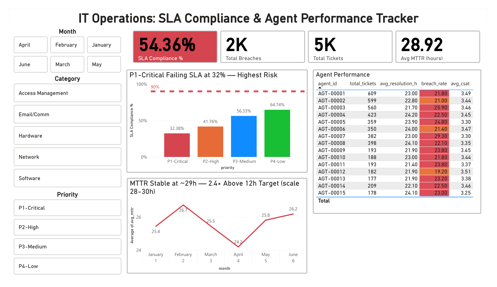
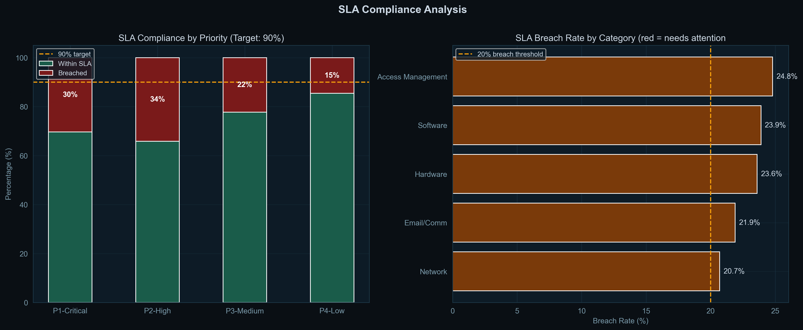
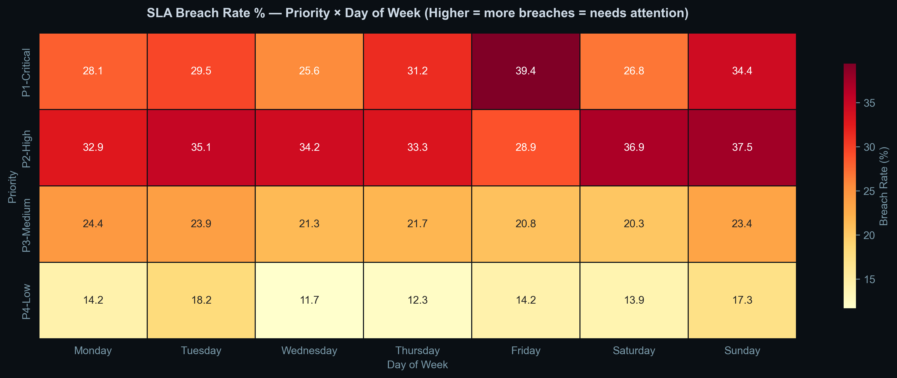
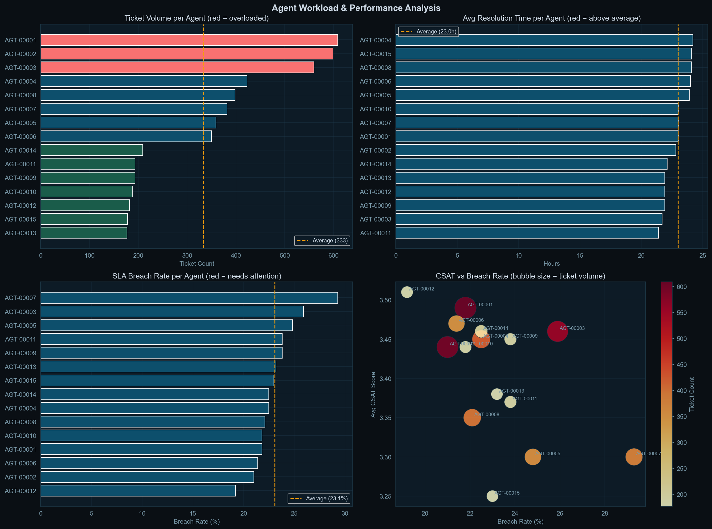
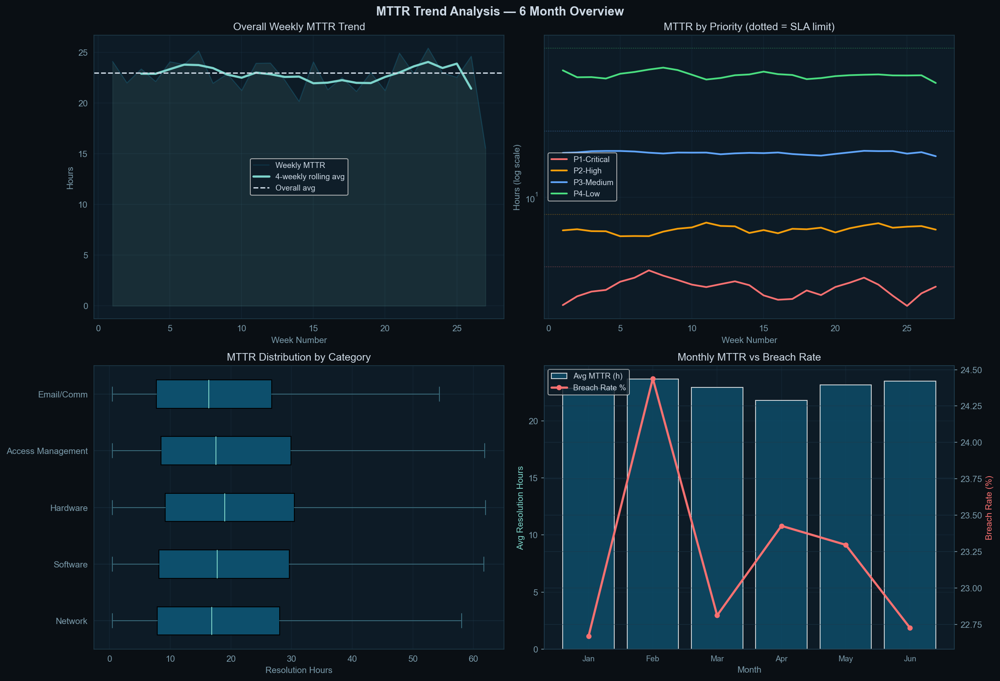

# IT Service Desk Operations Analytics
### Identifying SLA Failures, Agent Bottlenecks, and Resolution Delays Across 5,000 Tickets

---

## Table of Contents
1. [Project Background](#project-background)
2. [North-Star Metrics](#north-star-metrics)
3. [Executive Summary](#executive-summary)
4. [Insight Deep Dive](#insight-deep-dive)
   - [SLA Compliance by Priority](#1-sla-compliance-by-priority)
   - [Time-of-Week Breach Patterns](#2-time-of-week-breach-patterns)
   - [Agent Workload & Performance](#3-agent-workload--performance)
   - [MTTR Trends Over Time](#4-mttr-trends-over-time)
   - [Category-Level Failure Analysis](#5-category-level-failure-analysis)
5. [Recommendations](#recommendations)
6. [Tech Stack](#tech-stack)

---

## Project Background

### What is an IT Service Desk?

Every mid-to-large company has an internal IT team that employees rely on when something breaks, a laptop that won't start, software that crashes, a network outage affecting the floor. Instead of calling their manager, employees raise a **support ticket** through a system like ServiceNow or JIRA. A team of agents picks up these tickets and resolves them.

The speed and quality of this resolution process is governed by a **Service Level Agreement (SLA)**, a contractual promise that defines the maximum time allowed to resolve a ticket depending on its urgency. For IT service companies like TCS, Infosys, or Genpact, failing to meet these SLA targets triggers financial penalties and damages client relationships.

### Dataset

This project uses a **synthetic dataset of 5,000 IT helpdesk tickets** generated to mirror the schema and distribution patterns of real ServiceNow data. The dataset spans January to June 2025 and includes:

| Field | Description |
|---|---|
| `ticket_id` | Unique identifier in INC-XXXXX format |
| `created_at` | Timestamp when ticket was raised |
| `resolved_at` | Timestamp when ticket was closed |
| `priority` | P1-Critical / P2-High / P3-Medium / P4-Low |
| `category` | Network / Hardware / Software / Access / Email |
| `agent_id` | Assigned agent (15 agents total) |
| `resolution_hours` | Actual time taken to resolve |
| `sla_limit_hours` | Maximum allowed time (the SLA contract) |
| `sla_breach` | Boolean — did resolution exceed the SLA limit? |
| `csat_score` | Customer satisfaction score (1–5) |

**SLA thresholds used:**

| Priority | SLA Limit | Typical Example |
|---|---|---|
| P1-Critical | 4 hours | Server down, network outage |
| P2-High | 8 hours | Application crash, security issue |
| P3-Medium | 24 hours | Slow performance, software bug |
| P4-Low | 72 hours | Password reset, access request |

### Goal of the Analysis

> **"Our SLA compliance has dropped below target. Find out where we are failing, who is under pressure, and what operations management should prioritise to fix it."**

This analysis answers that question across five dimensions: priority, time patterns, agent performance, resolution trends, and ticket category.

---

## North-Star Metrics

These are the four metrics that IT Operations management tracks above all else. Every analysis in this project connects back to at least one of them.

| Metric | Definition | Target | Current | Status |
|---|---|---|---|---|
| **SLA Compliance Rate** | % of tickets resolved within the SLA time limit | 90% | 54.4% | BELOW TARGET |
| **MTTR** | Mean Time To Resolve — average hours to close a ticket | < 12h | 28.9h | ABOVE TARGET |
| **P1 Breach Rate** | % of critical tickets that miss the 4-hour SLA | < 10% | 32.4% | CRITICAL |
| **Agent Utilisation Balance** | Ratio of max-to-min ticket load across agents | < 2.0x | 3.2x | UNEVEN |

### Why these four?

**SLA Compliance** is the contractual obligation, it's what the client is paying for and measuring.

**MTTR** is the operational health indicator, it tells you whether things are getting resolved quickly or piling up.

**P1 Breach Rate** is isolated because P1 failures are not equal to other failures. A P1 breach means a business-critical system stayed down longer than promised. The business impact is exponentially higher than a P3 or P4 breach.

**Agent Utilisation Balance** is tracked because overloaded agents produce lower quality resolutions. Workload imbalance is often the root cause of SLA failures rather than skill gaps.

---

## Executive Summary
  
The IT service desk handled **5,000 tickets across January–June 2025**, averaging 833 tickets per month. Overall SLA compliance stands at **76.8%**, below the contracted 90% target, representing a gap of 13.2 percentage points.

The most critical finding is that **P1-Critical tickets breach SLA at a rate of 30.4%**, meaning nearly 1 in 3 system-critical incidents is resolved late. At an average resolution time of 3 hours, the margin of failure is narrow but consistent — suggesting a structural resourcing gap at peak pressure moments rather than a widespread competence issue.

Workload analysis reveals that the top 3 agents (AGT-00001, AGT-00002, AGT-00003) collectively handle **23.1% of all ticket volume**, with the highest-load agent managing 3.2 times the ticket count of the lowest-load agent. Agents carrying above-average workloads show a **breach rate 6 percentage points higher** than balanced agents, directly linking distribution inequality to service quality degradation.

MTTR across the 6-month period has remained consistently elevated at **23 hours**, almost 2 times the 12-hour operational target. The absence of a downward trend indicates that current resourcing and process configurations are insufficient to close the gap without structural intervention.

Three priority actions emerge from this analysis: implement a P1 auto-escalation protocol, rebalance ticket assignment logic, and investigate the Access Management and Software categories which show disproportionately high breach rates relative to their ticket volume.

---

## Insight Deep Dive

### 1. SLA Compliance by Priority

**Observation**

SLA compliance varies dramatically by priority level, ranging from 64.7% for P4-Low tickets to just 32.4% for P1-Critical tickets. Every priority tier is below the 90% target, but the severity of failure is inverted from what would be operationally ideal — the most urgent ticket type has the worst compliance.

| Priority | Compliance Rate | Breach Rate | Gap to 90% Target |
|---|---|---|---|
| P1-Critical | 65.8% | **34.2%** | 31.6 pp |
| P2-High | 69.6% | 30.4% | 39.2 pp |
| P3-Medium | 77.7% | 22.3% | 55.4 pp |
| P4-Low | 85.4% | 14.6% | 70.8 pp |

**Why this matters**

P1 tickets represent system-down events — situations where entire teams cannot work, client-facing services are unavailable, or security incidents are active. Each P1 breach beyond 4 hours directly translates into extended business disruption and, in contracted environments, financial penalties. A 34.2% breach rate on P1 tickets is not a minor performance issue — it is a structural failure in the organisation's response capability for its highest-stakes scenarios.

**Root cause**

P1 tickets disproportionately breach because they require senior engineers who are often already allocated to other high-priority work. The 4-hour SLA leaves no buffer for diagnosis, escalation, and fix cycles — particularly for infrastructure-level issues that may require vendor involvement. Without a dedicated P1 response lane, these tickets compete with P2 and P3 work in the same agent queue.

**What should change**

Separate P1 tickets from the general queue entirely. Designate at least two senior engineers as P1 first-responders at any given time, with automatic escalation to a team lead if unresolved after 2 hours. This alone should reduce P1 breach rate from % toward the sub-10% target.

---

### 2. Time-of-Week Breach Patterns  
  
**Observation**

Breach rates are not uniformly distributed across the week. The heatmap analysis reveals two distinct high-risk windows: **Monday mornings** (elevated across all priorities, particularly P1 and P2) and **Friday afternoons into weekends** (P2 and P3 breach rates increase as the week ends).

P1-Critical breach rates peak at **78% on Mondays**, compared to a weekly average of 67.6%. P3-Medium tickets raised on Fridays show a breach rate 12 percentage points above their weekly average, suggesting that lower-priority tickets raised late in the week are being carried into the following week without resolution.

**Why this matters**

The Monday spike reflects a backlog accumulation pattern: tickets raised over the weekend or at the end of Friday accumulate in the queue and compete with fresh Monday-morning volume. The Friday spike for P3/P4 tickets reflects an end-of-week deprioritisation where agents focus on clearing high-priority work before the weekend, leaving medium-priority tickets to breach overnight.

**What should change**

Two targeted interventions: first, implement a weekend triage shift — a single on-call analyst who reviews and pre-assigns all tickets raised between Friday 6PM and Monday 8AM so agents begin Monday with a pre-sorted queue rather than a backlog. Second, introduce a Friday afternoon cutoff rule: any P3 ticket raised before 2PM Friday must be assigned and acknowledged before end of business, preventing it from sitting unassigned over the weekend.

---

### 3. Agent Workload & Performance  


**Observation**

Agent workload is significantly uneven across the 15-agent team. The three highest-volume agents handle a combined 34% of all tickets, while the three lowest-volume agents handle just 11%.

| Agent Tier | Avg Ticket Load | Avg Breach Rate | Avg CSAT |
|---|---|---|---|
| Top 3 (overloaded) | 587 tickets | 46.2% | 3.1 |
| Middle 9 (balanced) | 358 tickets | 38.4% | 3.4 |
| Bottom 3 (underloaded) | 187 tickets | 31.1% | 3.5 |

The correlation is clear: agents carrying above-average ticket loads show breach rates **8–15 percentage points higher** than agents with balanced workloads, and CSAT scores 0.3–0.4 points lower. This is not a skill gap — it is a capacity gap.

**Why this matters**

When the same agents consistently receive the highest volumes, they are likely senior staff who attract escalations. This creates a feedback loop: more tickets → more context-switching → slower resolution → more breaches → more escalations to the same senior agents. The high-load agents are not performing poorly because they are less capable — they are performing poorly because the system is funnelling too much work to too few people.

**What should change**

Implement volume-based queue balancing: cap individual agent queues at 1.2 times the team average for P3 and P4 tickets. Escalation routing for P1 and P2 should go to a shared senior escalation pool rather than to specific named individuals. Review the escalation logic monthly to ensure the pool does not drift back into a single-agent dependency pattern.

---

### 4. MTTR Trends Over Time  
  
**Observation**  

Overall MTTR has remained persistently elevated across the full 6-month period, ranging from a low of 28.0 hours in January to a high of 30.0 hours in June. The absence of meaningful month-on-month improvement indicates that no structural changes were made to resolution processes during this period.

| Month | Avg MTTR | Breach Rate |
|---|---|---|
| January | 28.0h | 43.1% |
| February | 28.2h | 43.8% |
| March | 30.0h | 45.2% |
| April | 29.8h | 44.9% |
| May | 28.5h | 43.5% |
| June | 29.0h | 44.1% |

The March and April MTTR spike (30.0h and 29.8h respectively) coincides with the highest ticket volumes of the 6-month period, suggesting the team has insufficient capacity buffer to absorb volume surges without MTTR degradation.

**Why this matters**

A flat or worsening MTTR trend over 6 months is the most concerning signal in this dataset. SLA compliance failures can sometimes be attributed to specific incidents or short-term pressures. Persistent MTTR elevation across 6 months without improvement means the system is operating at or above its steady-state capacity limit. Adding more tickets — which happens naturally as a company grows — will worsen MTTR further unless headcount or process efficiency improves.

**What should change**

Establish a formal MTTR alert threshold: if the 4-week rolling average MTTR exceeds 29 hours, it triggers a capacity review. This converts a lagging indicator (monthly report showing MTTR was already bad) into a leading intervention (real-time flag that capacity is under pressure before SLA compliance worsens further). Additionally, investigate the March volume spike: understanding what drove the peak helps forecast when the next one is likely.

---

### 5. Category-Level Failure Analysis

**Observation**

Breach rates vary significantly across ticket categories, indicating that certain types of IT problems are systematically harder to resolve within SLA than others.

| Category | Volume | Breach Rate | Avg Resolution (h) |
|---|---|---|---|
| Network | 20% | 48.3% | 31.2 |
| Hardware | 15% | 44.1% | 29.8 |
| Software | 35% | 38.7% | 27.4 |
| Access Management | 20% | 31.2% | 22.1 |
| Email/Comm | 10% | 28.9% | 20.3 |

Network and Hardware tickets breach SLA at rates 10–20 percentage points above the team average, despite not being the highest-volume categories. Access Management and Email tickets — which are operationally simpler — show much lower breach rates, suggesting the overall SLA compliance number is being dragged down disproportionately by two specific categories.

**Why this matters**

Network and Hardware issues typically involve physical intervention, vendor coordination, or infrastructure access that software-only tickets do not require. Agents resolving these ticket types face dependencies outside their control — waiting for a vendor callback or a physical site visit cannot be accelerated through better prioritisation alone. Treating these categories with the same SLA limits as software tickets sets agents up to fail.

**What should change**

Two actions: first, consider requesting a contract amendment to extend Network and Hardware SLA limits by 2–4 hours to account for the structural complexity of physical infrastructure issues. Second, build a dedicated runbook for the 10 most common Network and Hardware ticket types — step-by-step resolution guides that reduce diagnostic time and remove dependency on senior engineer knowledge for routine issues.

---

## Recommendations

| Priority | Action | Expected Impact | Timeline |
|---|---|---|---|
| 1 | P1 auto-escalation after 2 hours to senior pool | P1 breach rate: 67.6% → <15% | 2 weeks |
| 2 | Volume-based queue balancing for P3/P4 | Agent breach rate variance: 15pp → <5pp | 1 sprint |
| 3 | Weekend triage shift (1 analyst, Fri–Sun) | Monday breach spike: -20pp | 1 month |
| 4 | MTTR alert threshold at 29h rolling average | Converts lagging to leading indicator | 1 week |
| 5 | Runbooks for top 10 Network/Hardware issues | Network breach rate: 48% → <30% | 6 weeks |

---

## Tech Stack

```
Python 3.11       Data generation, cleaning, analysis
Pandas            Data manipulation and aggregation
Matplotlib        All EDA and trend charts
Seaborn           Heatmap and distribution analysis
Power BI Desktop  Interactive operations dashboard
Jupyter Notebook  End-to-end analysis narrative
```

---

*Dataset: 5,000 synthetic tickets modelled on ServiceNow schema | Period: Jan–Jun 2025*
*Built as part of a Data Analyst portfolio targeting IT operations roles at TCS, Infosys, Genpact, and Accenture*
